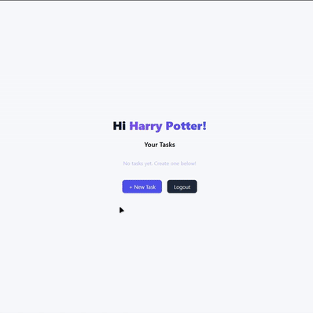

# WhatsToDo
A simple todo list web app built with Django for learning purposes. Users can add, update, and mark tasks as complete.

## 🎥Demo:


## ✨Features:
- User signup
- User login/logout
- Add tasks
- Edit existing tasks
- Mark tasks as complete
- Delete tasks
- Clean and minimal UI

## 🛠️Tech Stack:
- Django
- Html
- Tailwind css
- SQlite

## 🚀How to set up:
```
git clone https://github.com/cihpolino/WhatsToDo.git
cd WhatsToDo
python -m venv venv
source venv/bin/activate  # (or venv\Scripts\activate on Windows)
pip install -r requirements.txt
python manage.py migrate # (use 'py' instead of 'python' if needed)
python manage.py runserver
```

## 💻Usage:
After setup, open http://127.0.0.1:8000. Sign up and start managing your tasks — simple as that! Have fun idk ;3
P.S. Email verification isn’t enabled, so you can use any address that looks like an email, e.g. example@mail.com .